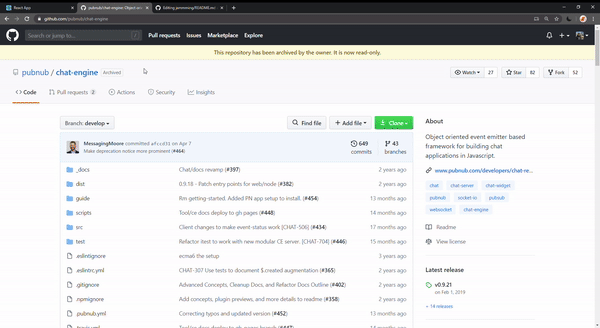

# Automatic Project Structures for README's

## Description
A web application that helps automate README creation

## How it Works
Head to [URL](https://project-structure-readme.netlify.app/) and type in your Github Project URL and watch a MarkDown Accessible README with pre-filled descriptions appear!
With a one-click Copy/Paste you can update your README with the best MarkDown Project Structure README's you've ever seen!
```Example Github Project URL: https://github.com/MLH-Fellowship/0.2.1-readme-dirs```



### WHY
We built this tool two solve two major issues and two minor issues:
#### Major Issues
1) README's don't contain project structures which make it difficult for contributors to understand where everything is and how what's happening inside the repository.
2) Existing Project Structures don't have hyperlinks making the UX of a project structure a bit difficult to navigate with excessive scrolling or third party plugins to extend the functionality. This requires no third-party software and can be done right in Github natively!
#### Minor Issues
1) You can plug in any repo you want to contribute to and completely understand what every folder does thanks to auto generated documentation!
2) You can attach Badges to your repository to help people find the correct NPM Package your repository references!

# Technologies
- [React](https://reactjs.org/) - To Build out the front-end application
- [Github V3 REST API](https://developer.github.com/v3/) - To pull Tree Structures from Github Repositories
- [JavaScript (ES6)](https://www.javascript.com/) - To execute API Requests
- [TypeScript](https://www.typescriptlang.org/)
- [Styled Components (CSS-IN-JS Framework)](http://styled-components.com/)
- [HTML](https://www.w3schools.com/html/html_intro.asp)
- [CSS](https://www.w3schools.com/css/)
- [Babel](https://babeljs.io/)
